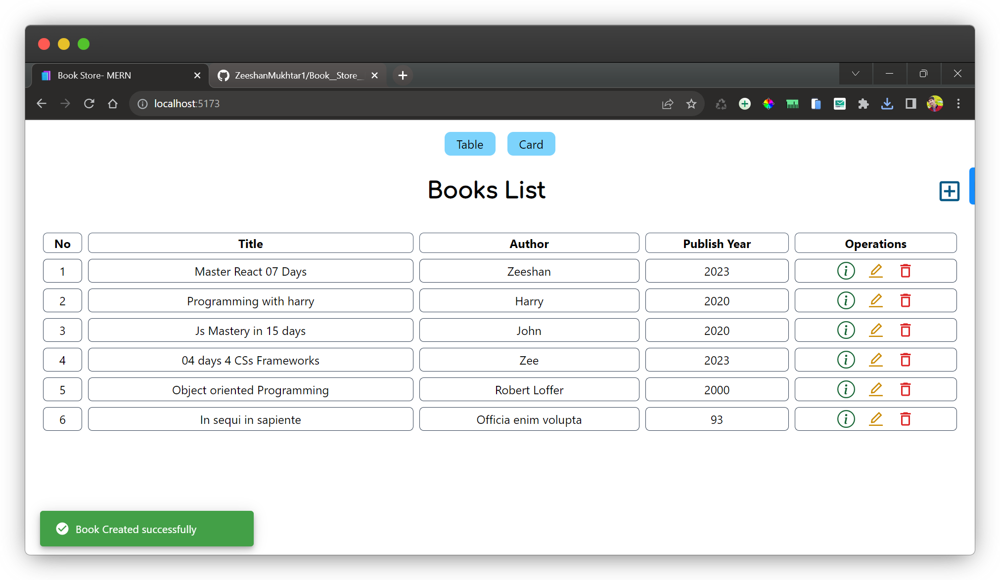

## Project Title

Bookstore MERN Stack App

### Project Description

Welcome to the Bookstore MERN Stack App repository! This web application is designed to help you manage your book collection efficiently. It utilizes a modern tech stack, including [React](https://legacy.reactjs.org/) for the front end, [MongoDB Atlas](https://www.mongodb.com/cloud/atlas/lp/try4?utm_source=google&utm_campaign=search_gs_pl_evergreen_atlas_core_prosp-brand_gic-null_emea-pk_ps-all_desktop_eng_lead&utm_term=mongodb%20atlas&utm_medium=cpc_paid_search&utm_ad=e&utm_ad_campaign_id=12212624545&adgroup=115749719183&cq_cmp=12212624545&gad=1&gclid=CjwKCAjwo9unBhBTEiwAipC11--H9qPPOX3703XSeRHJqSe0ZJJ2Wmqq1R5XimEiWvgFnK2UIdbucxoCmMUQAvD_BwE) for cloud-based database storage, [Express](https://expressjs.com/) for the backend, and incorporates beautiful alerts for an enhanced user experience. Furthermore, the app employs [Tailwind CSS](https://tailwindcss.com/) for a sleek and responsive design.

### Features

- Easily add new books to your collection by providing book details such as title, author and Publish Year.

- Update book information whenever necessary, ensuring your library is always up to date.

- Remove books from your collection with a confirmation message to prevent accidental deletions
- Browse your entire book collection in two different layout options:

- Card View: A visually appealing card-based layout that showcases book details with cover images.

- Table View: A tabular view that provides a structured overview of your books.

## Screenshot

#### Developer

- [@ZeeshanMukhtar1](https://www.linkedin.com/in/zeeshanmukhtar1/)

## 🔗 Links

##### Credits:

[freecCdeCamp](https://www.freecodecamp.org/)
